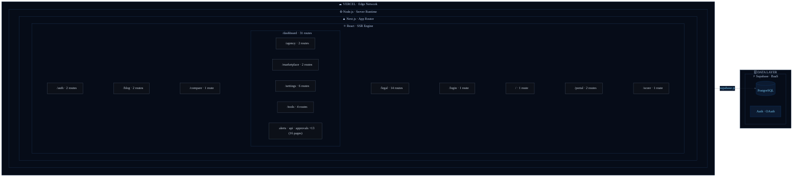

# Rendering Architecture

```mermaid
%%{init:{'theme':'base','themeVariables':{'background':'#060810','primaryColor':'#0c1a30','primaryTextColor':'#7dd3fc','primaryBorderColor':'#0e3a6e','edgeLabelBackground':'#0c1a30','lineColor':'#334155','secondaryColor':'#0f172a','clusterBkg':'#060c18','clusterBorder':'#1e3a5f','fontFamily':'JetBrains Mono','fontSize':'14'}}}%%
graph LR
  classDef ssr fill:#0d1a0d,stroke:#16a34a,color:#86efac
  classDef csr fill:#2d1200,stroke:#c2410c,color:#fb923c
  classDef ssg fill:#1a0d1a,stroke:#7c3aed,color:#c4b5fd
  classDef isr fill:#1a1a0d,stroke:#ca8a04,color:#fde047
  classDef ppr fill:#0d1a2d,stroke:#2563eb,color:#93c5fd
  classDef unk fill:#1a1a1a,stroke:#6b7280,color:#9ca3af
  classDef pkg fill:#0c1018,stroke:#475569,color:#cbd5e1
  classDef muted fill:#0a0d14,stroke:#374151,color:#64748b,stroke-dasharray: 3 3
  classDef hdr fill:#06080f,stroke:#1e3a5f,color:#7dd3fc
  subgraph INFRA["☁ VERCEL · Edge Network"]
    subgraph RUNTIME["⚙ Node.js · Server Runtime"]
      subgraph FRAMEWORK["▲ Next.js · App Router"]
        subgraph REACT["⚛ React · SSR Engine"]
          T1_auth["📁 /auth · 2 routes"]:::pkg
          T1_blog["📁 /blog · 2 routes"]:::pkg
          T1_compare["📁 /compare · 1 route"]:::pkg
          subgraph T1_dashboard_G["📁 /dashboard · 31 routes"]
            T1_dashboard_agency["📁 /agency · 2 routes"]:::pkg
            T1_dashboard_marketplace["📁 /marketplace · 2 routes"]:::pkg
            T1_dashboard_settings["📁 /settings · 6 routes"]:::pkg
            T1_dashboard_tools["📁 /tools · 4 routes"]:::pkg
            T1_dashboard_PAGES["📄 alerts · api · approvals +13 (16 pages)"]:::pkg
          end
          T1_legal["📁 /legal · 14 routes"]:::pkg
          T1_login["📁 /login · 1 route"]:::pkg
          T1_root["📁 / · 1 route"]:::pkg
          T1_portal["📁 /portal · 2 routes"]:::pkg
          T1_score["📁 /score · 1 route"]:::pkg
          T1_auth ~~~ T1_blog ~~~ T1_compare ~~~ T1_dashboard_G ~~~ T1_legal ~~~ T1_login ~~~ T1_root ~~~ T1_portal ~~~ T1_score
        end
      end
    end
  end
  subgraph DATALAYER["🗄 DATA LAYER"]
    subgraph SUPABASE_G["⚡ Supabase · BaaS"]
      PG_SB[("PostgreSQL")]
      SB_AUTH["Auth · OAuth"]
    end
  end
  INFRA -.->|"supabase-js"| PG_SB
```
