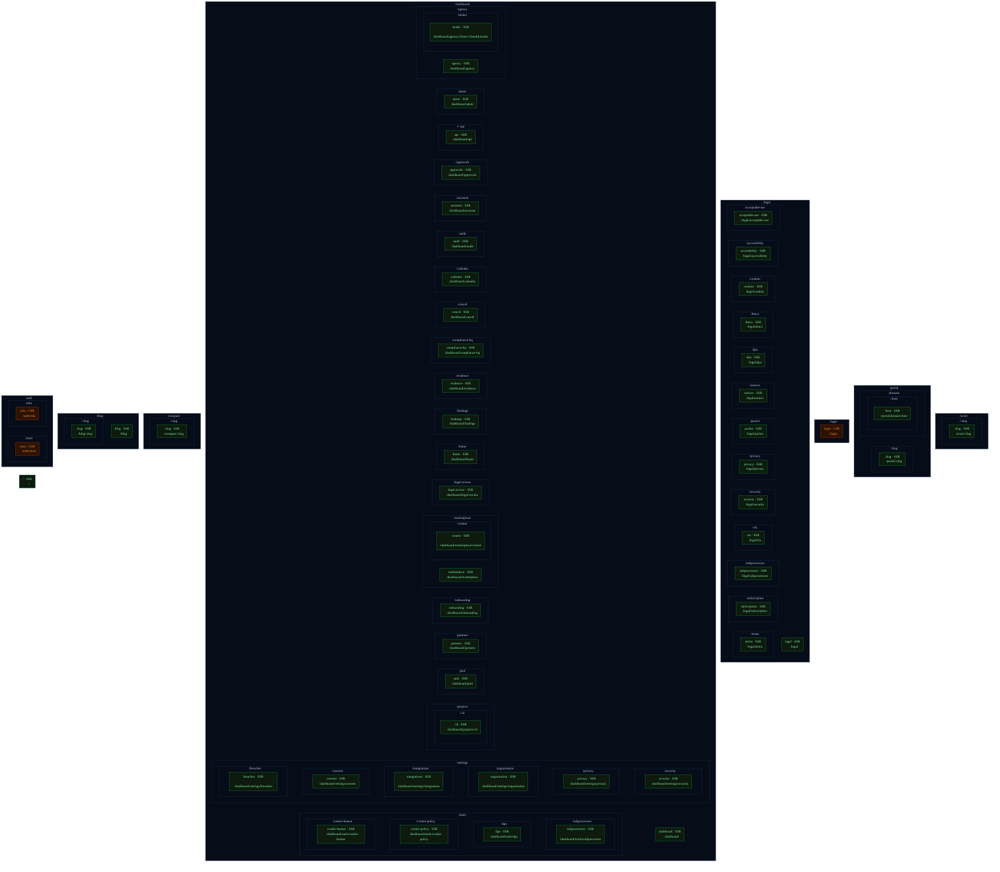

# Screen–Component Mapping

```mermaid
%%{init:{'theme':'base','themeVariables':{'background':'#060810','primaryColor':'#0c1a30','primaryTextColor':'#7dd3fc','primaryBorderColor':'#0e3a6e','edgeLabelBackground':'#0c1a30','lineColor':'#334155','secondaryColor':'#0f172a','clusterBkg':'#060c18','clusterBorder':'#1e3a5f','fontFamily':'JetBrains Mono','fontSize':'14'},'flowchart':{'nodeSpacing':40,'rankSpacing':24,'padding':8}}}%%
graph LR
  classDef ssr fill:#0d1a0d,stroke:#16a34a,color:#86efac
  classDef csr fill:#2d1200,stroke:#c2410c,color:#fb923c
  classDef ssg fill:#1a0d1a,stroke:#7c3aed,color:#c4b5fd
  classDef isr fill:#1a1a0d,stroke:#ca8a04,color:#fde047
  classDef ppr fill:#0d1a2d,stroke:#2563eb,color:#93c5fd
  classDef unk fill:#1a1a1a,stroke:#6b7280,color:#9ca3af
  classDef pkg fill:#0c1018,stroke:#475569,color:#cbd5e1
  classDef muted fill:#0a0d14,stroke:#374151,color:#64748b,stroke-dasharray: 3 3
  classDef hdr fill:#06080f,stroke:#1e3a5f,color:#7dd3fc
  subgraph AUTH_T["🔐 /auth"]
    subgraph AUTH_MFA_T["📄 /mfa"]
      route_src_app_auth_mfa_page["mfa · CSR<br/>🔗 /auth/mfa"]:::csr
    end
    subgraph AUTH_RESET_T["📄 /reset"]
      route_src_app_auth_reset_page["reset · CSR<br/>🔗 /auth/reset"]:::csr
    end
  end
  AUTH_MFA_T ~~~ AUTH_RESET_T
  subgraph BLOG_T["📝 /blog"]
    route_src_app_blog_page["blog · SSR<br/>🔗 /blog"]:::ssr
    subgraph BLOG__SLUG_T["📄 /:slug"]
      route_src_app_blog__slug__page[":slug · SSR<br/>🔗 /blog/:slug"]:::ssr
    end
  end
  subgraph COMPARE_T["📄 /compare"]
    subgraph COMPARE__SLUG_T["📄 /:slug"]
      route_src_app_compare__slug__page[":slug · SSR<br/>🔗 /compare/:slug"]:::ssr
    end
  end
  subgraph DASHBOARD_T["📄 /dashboard"]
    route_src_app_dashboard_page["dashboard · SSR<br/>🔗 /dashboard"]:::ssr
    subgraph DASHBOARD_AGENCY_T["📄 /agency"]
      route_src_app_dashboard_agency_page["agency · SSR<br/>🔗 /dashboard/agency"]:::ssr
      subgraph DASHBOARD_AGENCY_CLIENTS__CLIENTID_INTAKE_T["📄 /intake"]
        route_src_app_dashboard_agency_clients__clientId__intake_page["intake · SSR<br/>🔗 /dashboard/agency/clients/:clientId/intake"]:::ssr
      end
    end
    subgraph DASHBOARD_ALERTS_T["📄 /alerts"]
      route_src_app_dashboard_alerts_page["alerts · SSR<br/>🔗 /dashboard/alerts"]:::ssr
    end
    subgraph DASHBOARD_API_T["⚡ /api"]
      route_src_app_dashboard_api_page["api · SSR<br/>🔗 /dashboard/api"]:::ssr
    end
    subgraph DASHBOARD_APPROVALS_T["📄 /approvals"]
      route_src_app_dashboard_approvals_page["approvals · SSR<br/>🔗 /dashboard/approvals"]:::ssr
    end
    subgraph DASHBOARD_ASSISTANT_T["📄 /assistant"]
      route_src_app_dashboard_assistant_page["assistant · SSR<br/>🔗 /dashboard/assistant"]:::ssr
    end
    subgraph DASHBOARD_AUDIT_T["📄 /audit"]
      route_src_app_dashboard_audit_page["audit · SSR<br/>🔗 /dashboard/audit"]:::ssr
    end
    subgraph DASHBOARD_CALENDAR_T["📄 /calendar"]
      route_src_app_dashboard_calendar_page["calendar · SSR<br/>🔗 /dashboard/calendar"]:::ssr
    end
    subgraph DASHBOARD_CANCEL_T["📄 /cancel"]
      route_src_app_dashboard_cancel_page["cancel · SSR<br/>🔗 /dashboard/cancel"]:::ssr
    end
    subgraph DASHBOARD_COMPLIANCE_HQ_T["📄 /compliance-hq"]
      route_src_app_dashboard_compliance_hq_page["compliance-hq · SSR<br/>🔗 /dashboard/compliance-hq"]:::ssr
    end
    subgraph DASHBOARD_EVIDENCE_T["📄 /evidence"]
      route_src_app_dashboard_evidence_page["evidence · SSR<br/>🔗 /dashboard/evidence"]:::ssr
    end
    subgraph DASHBOARD_FINDINGS_T["📄 /findings"]
      route_src_app_dashboard_findings_page["findings · SSR<br/>🔗 /dashboard/findings"]:::ssr
    end
    subgraph DASHBOARD_HOME_T["📄 /home"]
      route_src_app_dashboard_home_page["home · SSR<br/>🔗 /dashboard/home"]:::ssr
    end
    subgraph DASHBOARD_LEGAL_REVIEW_T["📄 /legal-review"]
      route_src_app_dashboard_legal_review_page["legal-review · SSR<br/>🔗 /dashboard/legal-review"]:::ssr
    end
    subgraph DASHBOARD_MARKETPLACE_T["📄 /marketplace"]
      route_src_app_dashboard_marketplace_page["marketplace · SSR<br/>🔗 /dashboard/marketplace"]:::ssr
      subgraph DASHBOARD_MARKETPLACE_CREATOR_T["📄 /creator"]
        route_src_app_dashboard_marketplace_creator_page["creator · SSR<br/>🔗 /dashboard/marketplace/creator"]:::ssr
      end
    end
    subgraph DASHBOARD_ONBOARDING_T["📄 /onboarding"]
      route_src_app_dashboard_onboarding_page["onboarding · SSR<br/>🔗 /dashboard/onboarding"]:::ssr
    end
    subgraph DASHBOARD_PARTNERS_T["📄 /partners"]
      route_src_app_dashboard_partners_page["partners · SSR<br/>🔗 /dashboard/partners"]:::ssr
    end
    subgraph DASHBOARD_PMF_T["📄 /pmf"]
      route_src_app_dashboard_pmf_page["pmf · SSR<br/>🔗 /dashboard/pmf"]:::ssr
    end
    subgraph DASHBOARD_PROJECTS_T["📁 /projects"]
      subgraph DASHBOARD_PROJECTS__ID_T["📄 /:id"]
        route_src_app_dashboard_projects__id__page[":id · SSR<br/>🔗 /dashboard/projects/:id"]:::ssr
      end
    end
    subgraph DASHBOARD_SETTINGS_T["📄 /settings"]
      subgraph DASHBOARD_SETTINGS_BREACHES_T["📄 /breaches"]
        route_src_app_dashboard_settings_breaches_page["breaches · SSR<br/>🔗 /dashboard/settings/breaches"]:::ssr
      end
      subgraph DASHBOARD_SETTINGS_CONSENT_T["📄 /consent"]
        route_src_app_dashboard_settings_consent_page["consent · SSR<br/>🔗 /dashboard/settings/consent"]:::ssr
      end
      subgraph DASHBOARD_SETTINGS_INTEGRATIONS_T["📄 /integrations"]
        route_src_app_dashboard_settings_integrations_page["integrations · SSR<br/>🔗 /dashboard/settings/integrations"]:::ssr
      end
      subgraph DASHBOARD_SETTINGS_ORGANIZATION_T["📄 /organization"]
        route_src_app_dashboard_settings_organization_page["organization · SSR<br/>🔗 /dashboard/settings/organization"]:::ssr
      end
      subgraph DASHBOARD_SETTINGS_PRIVACY_T["📄 /privacy"]
        route_src_app_dashboard_settings_privacy_page["privacy · SSR<br/>🔗 /dashboard/settings/privacy"]:::ssr
      end
      subgraph DASHBOARD_SETTINGS_SECURITY_T["📄 /security"]
        route_src_app_dashboard_settings_security_page["security · SSR<br/>🔗 /dashboard/settings/security"]:::ssr
      end
    end
    DASHBOARD_SETTINGS_BREACHES_T ~~~ DASHBOARD_SETTINGS_CONSENT_T ~~~ DASHBOARD_SETTINGS_INTEGRATIONS_T ~~~ DASHBOARD_SETTINGS_ORGANIZATION_T ~~~ DASHBOARD_SETTINGS_PRIVACY_T ~~~ DASHBOARD_SETTINGS_SECURITY_T
    subgraph DASHBOARD_TOOLS_T["📄 /tools"]
      subgraph DASHBOARD_TOOLS_COOKIE_BANNER_T["📄 /cookie-banner"]
        route_src_app_dashboard_tools_cookie_banner_page["cookie-banner · SSR<br/>🔗 /dashboard/tools/cookie-banner"]:::ssr
      end
      subgraph DASHBOARD_TOOLS_COOKIE_POLICY_T["📄 /cookie-policy"]
        route_src_app_dashboard_tools_cookie_policy_page["cookie-policy · SSR<br/>🔗 /dashboard/tools/cookie-policy"]:::ssr
      end
      subgraph DASHBOARD_TOOLS_DPA_T["📄 /dpa"]
        route_src_app_dashboard_tools_dpa_page["dpa · SSR<br/>🔗 /dashboard/tools/dpa"]:::ssr
      end
      subgraph DASHBOARD_TOOLS_SUBPROCESSORS_T["📄 /subprocessors"]
        route_src_app_dashboard_tools_subprocessors_page["subprocessors · SSR<br/>🔗 /dashboard/tools/subprocessors"]:::ssr
      end
    end
    DASHBOARD_TOOLS_COOKIE_BANNER_T ~~~ DASHBOARD_TOOLS_COOKIE_POLICY_T ~~~ DASHBOARD_TOOLS_DPA_T ~~~ DASHBOARD_TOOLS_SUBPROCESSORS_T
  end
  DASHBOARD_AGENCY_T ~~~ DASHBOARD_ALERTS_T ~~~ DASHBOARD_API_T ~~~ DASHBOARD_APPROVALS_T ~~~ DASHBOARD_ASSISTANT_T ~~~ DASHBOARD_AUDIT_T ~~~ DASHBOARD_CALENDAR_T ~~~ DASHBOARD_CANCEL_T ~~~ DASHBOARD_COMPLIANCE_HQ_T ~~~ DASHBOARD_EVIDENCE_T ~~~ DASHBOARD_FINDINGS_T ~~~ DASHBOARD_HOME_T ~~~ DASHBOARD_LEGAL_REVIEW_T ~~~ DASHBOARD_MARKETPLACE_T ~~~ DASHBOARD_ONBOARDING_T ~~~ DASHBOARD_PARTNERS_T ~~~ DASHBOARD_PMF_T ~~~ DASHBOARD_PROJECTS_T ~~~ DASHBOARD_SETTINGS_T ~~~ DASHBOARD_TOOLS_T
  subgraph LEGAL_T["📄 /legal"]
    route_src_app_legal_page["legal · SSR<br/>🔗 /legal"]:::ssr
    subgraph LEGAL_ACCEPTABLE_USE_T["📄 /acceptable-use"]
      route_src_app_legal_acceptable_use_page["acceptable-use · SSR<br/>🔗 /legal/acceptable-use"]:::ssr
    end
    subgraph LEGAL_ACCESSIBILITY_T["📄 /accessibility"]
      route_src_app_legal_accessibility_page["accessibility · SSR<br/>🔗 /legal/accessibility"]:::ssr
    end
    subgraph LEGAL_COOKIES_T["📄 /cookies"]
      route_src_app_legal_cookies_page["cookies · SSR<br/>🔗 /legal/cookies"]:::ssr
    end
    subgraph LEGAL_DMCA_T["📄 /dmca"]
      route_src_app_legal_dmca_page["dmca · SSR<br/>🔗 /legal/dmca"]:::ssr
    end
    subgraph LEGAL_DPA_T["📄 /dpa"]
      route_src_app_legal_dpa_page["dpa · SSR<br/>🔗 /legal/dpa"]:::ssr
    end
    subgraph LEGAL_NOTICES_T["📄 /notices"]
      route_src_app_legal_notices_page["notices · SSR<br/>🔗 /legal/notices"]:::ssr
    end
    subgraph LEGAL_PACKET_T["📄 /packet"]
      route_src_app_legal_packet_page["packet · SSR<br/>🔗 /legal/packet"]:::ssr
    end
    subgraph LEGAL_PRIVACY_T["📄 /privacy"]
      route_src_app_legal_privacy_page["privacy · SSR<br/>🔗 /legal/privacy"]:::ssr
    end
    subgraph LEGAL_SECURITY_T["📄 /security"]
      route_src_app_legal_security_page["security · SSR<br/>🔗 /legal/security"]:::ssr
    end
    subgraph LEGAL_SLA_T["📄 /sla"]
      route_src_app_legal_sla_page["sla · SSR<br/>🔗 /legal/sla"]:::ssr
    end
    subgraph LEGAL_SUBPROCESSORS_T["📄 /subprocessors"]
      route_src_app_legal_subprocessors_page["subprocessors · SSR<br/>🔗 /legal/subprocessors"]:::ssr
    end
    subgraph LEGAL_SUBSCRIPTION_T["📄 /subscription"]
      route_src_app_legal_subscription_page["subscription · SSR<br/>🔗 /legal/subscription"]:::ssr
    end
    subgraph LEGAL_TERMS_T["📄 /terms"]
      route_src_app_legal_terms_page["terms · SSR<br/>🔗 /legal/terms"]:::ssr
    end
  end
  LEGAL_ACCEPTABLE_USE_T ~~~ LEGAL_ACCESSIBILITY_T ~~~ LEGAL_COOKIES_T ~~~ LEGAL_DMCA_T ~~~ LEGAL_DPA_T ~~~ LEGAL_NOTICES_T ~~~ LEGAL_PACKET_T ~~~ LEGAL_PRIVACY_T ~~~ LEGAL_SECURITY_T ~~~ LEGAL_SLA_T ~~~ LEGAL_SUBPROCESSORS_T ~~~ LEGAL_SUBSCRIPTION_T ~~~ LEGAL_TERMS_T
  subgraph LOGIN_T["📄 /login"]
    route_src_app_login_page["login · CSR<br/>🔗 /login"]:::csr
  end
  route_src_app_page["/ · SSR<br/>🔗 /"]:::ssr
  subgraph PORTAL_T["📄 /portal"]
    subgraph PORTAL_DOMAIN_T["📄 /domain"]
      subgraph PORTAL_DOMAIN__HOST_T["📄 /:host"]
        route_src_app_portal_domain__host__page[":host · SSR<br/>🔗 /portal/domain/:host"]:::ssr
      end
    end
    subgraph PORTAL__SLUG_T["📄 /:slug"]
      route_src_app_portal__slug__page[":slug · SSR<br/>🔗 /portal/:slug"]:::ssr
    end
  end
  PORTAL_DOMAIN_T ~~~ PORTAL__SLUG_T
  subgraph SCORE_T["📄 /score"]
    subgraph SCORE__SLUG_T["📄 /:slug"]
      route_src_app_score__slug__page[":slug · SSR<br/>🔗 /score/:slug"]:::ssr
    end
  end
  AUTH_T ~~~ BLOG_T ~~~ COMPARE_T ~~~ DASHBOARD_T ~~~ LEGAL_T ~~~ LOGIN_T ~~~ PORTAL_T ~~~ SCORE_T
```
